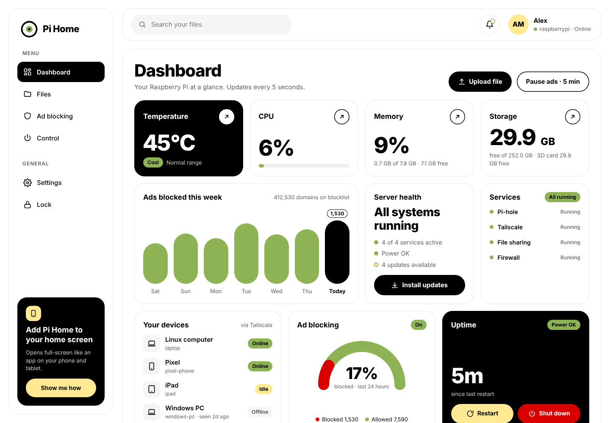
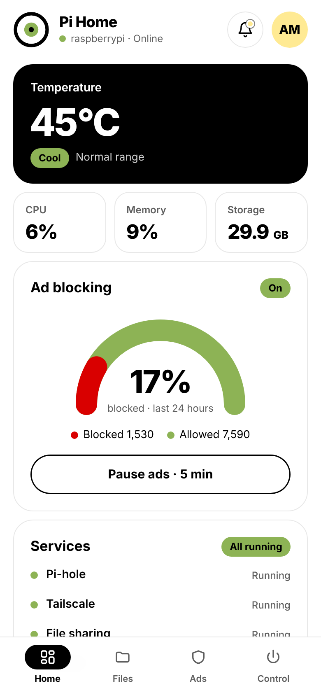
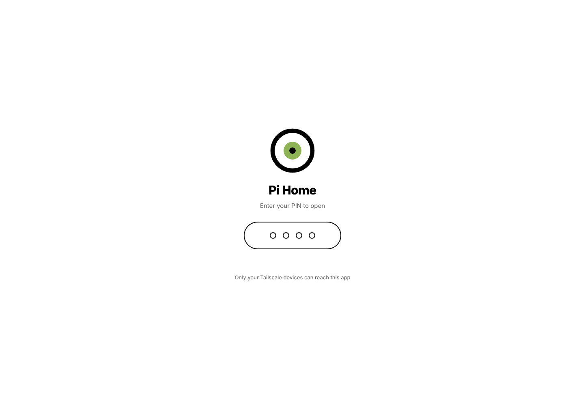

<p align="center">
  
</p>

<h1 align="center">Pi Home</h1>

<p align="center">
  A simple, private dashboard for your Raspberry Pi home server.<br>
  Check its health, manage files, control ad blocking and restart or update it, from your phone, tablet or computer.
</p>

<p align="center">
  
</p>

<p align="center">
  
  &nbsp;&nbsp;
  
</p>

## Features

**Dashboard**
- Live temperature, CPU, memory and storage, refreshed every 5 seconds
- Server health at a glance, with alerts for overheating, low power, stopped services and full disks
- Status of Pi-hole, Tailscale, Samba file sharing, the firewall and automatic updates (only the ones you have installed)
- Your Tailscale devices and whether they're online
- Uptime, with Restart and Shut down buttons

**Files**
- Browse, upload, download, rename, delete and search the files in one folder of your choice
- Drag and drop uploads on a computer
- Works alongside Samba, so the same folder stays available in your file manager

**Ad blocking (Pi-hole)**
- Ads blocked today, blocked share and blocklist size
- A 7-day chart and the most-blocked domains
- Pause blocking for 5 minutes, 30 minutes, 1 hour or until you resume
- Update blocklists with one tap

**Control**
- Install system updates and watch them run live
- Restart individual services
- Quick links to the Pi-hole, Tailscale and Raspberry Pi Connect admin pages

**Made for phones too**
- Installs to your home screen like an app (PWA) on iPhone, iPad and Android
- Clean phone layout with tabs at the bottom
- Uses your device's own number keyboard for the PIN

## Security

- **Private by default.** The app only listens on `127.0.0.1`. It's reached through [Tailscale](https://tailscale.com), so only devices in your own Tailscale network can open it, over HTTPS. Nothing is exposed to the internet and no router setup is needed.
- **PIN to open.** A 4 to 6 digit PIN, stored only as a salted PBKDF2 hash.
- **PIN again for big actions.** Restart, Shut down, Install updates, restarting services and deleting files all ask for the PIN.
- **Lockout.** Five wrong PINs lock it for 5 minutes.
- **Auto-lock.** Locks as soon as you leave the app, or after 1, 5 or 30 minutes. You choose in Settings.
- **Contained file access.** The Files page can only reach the one folder you choose.
- Strict browser security headers, and no third-party trackers.

## Requirements

- Raspberry Pi running **Raspberry Pi OS** (Bookworm or newer), or another Debian-based system
- **Tailscale**, installed and logged in on the Pi and on every device you want to use Pi Home from
- Optional: **Pi-hole v6** for the Ad blocking page
- Optional: **Samba** for file sharing, and an external drive for the Files page

Pi Home itself uses about 30 to 50 MB of memory.

## Install

On the Pi:

```bash
git clone https://github.com/acejagrut/pi-home.git
cd pi-home
sudo bash install.sh
```

The installer will:

1. Install Python and Flask if needed
2. Copy the app to `/opt/pi-home`
3. Ask which folder the Files page should use (default `/mnt/storage`) and what to call it
4. Ask you to choose a PIN
5. Start Pi Home and make it start on every boot
6. Turn on a private HTTPS link with `tailscale serve`

If a `login.tailscale.com` link appears in step 6, open it and click **Enable** to turn on HTTPS certificates for your Tailscale network. The installer waits for you.

When it's done, it prints your link, which looks like:

```
https://raspberrypi.your-tailnet.ts.net
```

Open that link on any of your Tailscale devices.

### Add it to your home screen

- **iPhone / iPad:** open the link in Safari, tap **Share**, then **Add to Home Screen**
- **Android:** open the link in Chrome, tap **⋮**, then **Install app**
- **Computer:** open it in Chrome or Edge and use the install icon in the address bar, or just bookmark it

## Update

Get the newest version and run the installer again. It keeps your PIN, photo and settings.

```bash
cd pi-home
git pull
sudo bash install.sh
```

## Commands

| Command | What it does |
|---|---|
| `pi-home link` | Show your private link |
| `pi-home status` | Check that it's running |
| `sudo pi-home pin` | Set a new PIN, also if you forgot it |
| `pi-home logs` | See recent messages, if something's wrong |
| `sudo pi-home restart` | Restart the app |
| `sudo pi-home uninstall` | Remove Pi Home. Your files are not touched. |

## Settings

Inside the app, **Settings** lets you:

- add a profile photo and your name, shown in the app and on the lock screen
- change your PIN
- choose when it auto-locks

Advanced settings live in `/etc/pi-home/pi-home.env`:

| Setting | Default | Meaning |
|---|---|---|
| `PIHOME_STORAGE` | `/mnt/storage` | Folder shown on the Files page |
| `PIHOME_STORAGE_NAME` | `Storage` | Name used for that folder in the app |
| `PIHOME_REQUIRE_MOUNT` | `1` if the folder is a mounted drive | Refuse uploads if the drive is unplugged, so files never fill the SD card |
| `PIHOME_PORT` | `8080` | Local port the app listens on |

Restart after changing them: `sudo pi-home restart`.

## Troubleshooting

**"Can't reach your Pi" or "Address not found" on a phone**

The phone can't look up the Tailscale name. Check that:

- the Tailscale app is on, and **Use Tailscale DNS** is enabled in its settings
- Chrome's **Use secure DNS** is off (Settings → Privacy and security)
- Android **Private DNS** is off
- on iPhone or iPad, **iCloud Private Relay** is off

**The Ad blocking page says Pi-hole isn't answering**

Pi Home talks to the Pi-hole v6 API at `http://127.0.0.1/api` using Pi-hole's built-in CLI password. Check that Pi-hole is running with `pihole status`.

**I forgot my PIN**

Run `sudo pi-home pin` on the Pi.

## How it works

- **Backend:** a single Python file using Flask. It reads system information from `/proc` and `/sys`, uses `systemctl`, `vcgencmd`, `apt` and `tailscale`, and talks to Pi-hole through its local API.
- **Frontend:** plain HTML, CSS and JavaScript. No build step and no frameworks.
- **Access:** `tailscale serve` gives the app an HTTPS address inside your Tailscale network and forwards it to `127.0.0.1:8080`.
- **Runs as** a systemd service named `pi-home`.

```
pi-home/
├── app.py              backend
├── static/             web app (HTML, CSS, JS, icons, PWA files)
├── install.sh          installer
├── bin/pi-home         helper command
└── docs/screenshots/
```

## License

[MIT](LICENSE)
